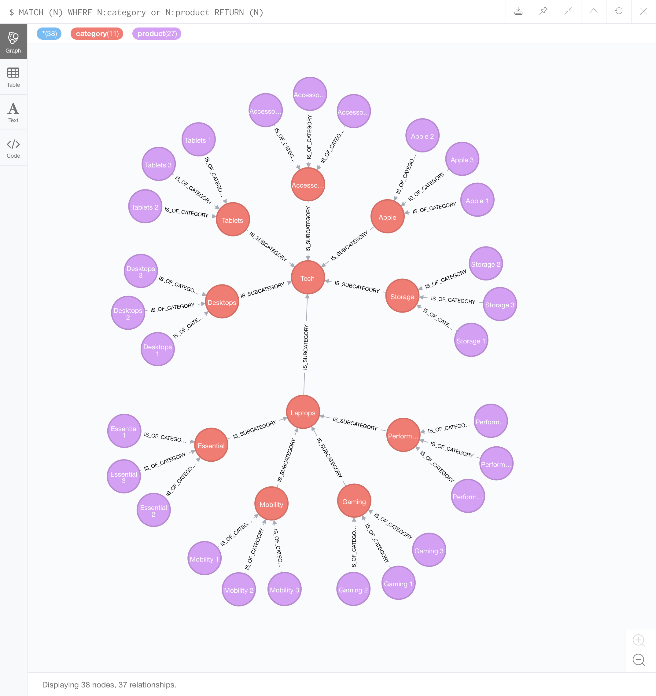

# Docker + Neo4J + Node.js app

## Challenge

In an online store there are a wide variety of products. Each product belongs to a category.
Each category may have a parent category. Each category may have zero or more sub-categories.

You can use any database you want (SQL or NoSQL), but the server has to be in Node.js and
 the app should be delivered with Docker. 

> Basically, the first of the problem describes _almost_ all online stores. The second part 
means that we are only free to choose the database technology.

### Use case

You need to create an API so we can ask for a category and you give us a list of all the products 
(even the ones from subcategories).

> Well, again, this is basically the behaviour of any online store.

### Out of scope

It was not discussed the size of the database (e.g., can it fit in a single server?) or any other 
possible issues.

> I avoided implementing this logic already, but the current implementation makes it somewhat easy to 
scale this solution.

## Choice of technologies

### Neo4J

[Neo4J](https://neo4j.com) is a NoSQL graph database. The problem description is easily adaptable to
 a graph and Neo4J eases the complexity of the queries. Bellow are some examples of possible queries:
 
**Add subcategories**
```
MATCH (parent:category)
WHERE parent.name = "Tech"
FOREACH (cat IN [“Laptops”, “Apple”, “Storage”, “Desktops”, “Tablet”,  “Accessories”] | CREATE ((:category{name:cat})-[:IS_SUBCATEGORY]->(parent)))
```

**Add products**
```
MATCH (cat:category)
WHERE cat.name <> "Laptops" AND cat.name <> "Tech"
FOREACH (prod IN [" 1", " 2", " 3"] |
CREATE ((p:product{name:cat.name+prod})-[:IS_OF_CATEGORY]->(cat)))
```

**Display all**
```
MATCH (N)
RETURN (N)
``` 

If you before doing these queries in order, you create a node labeled `product` and 
with the `name` property set to `Tech`, then you will end up with the following graph:



> Note: I do not entirely agree with the structure of these categories, but I am trying to 
replicate (in a very small scale) the 
[Fnac online store](https://www.fnac.pt/informatica/h10#bl=MMinformatica).

Regarding the implementation, the database is pretty small. This is not recommended to use in 
production, but, for the sake of portability, the entire database is located 
[in this repository](neo4j/). Not recommended, but for simplicity, the database has the default 
authentication.

### Node.js

Node.js was enforced, but its wide use made it simple to connect to the database. Luckily, Neo4J 
has a JavaScript driver, so the development ended up being pretty fast.

Node.js, besides serving as a back-end server (it provides the API to query the database), also 
serves a very simplistic HTML page powered by [Handlebars](https://handlebarsjs.com).

### Docker

All the technologies used are pretty known and used, so there was support to connect all this 
with docker. Neo4J and Node.js are separate containers connected to each other with docker compose.

Neo4J binds the database to the host. The image used is the one from Docker without any kind of
 customisation.

Node.js image is the one from Docker, but the app code is copied to the container. Also, Node.js is 
the only container that exposes a port to the exterior.

## Build

As said before, everything is connected with Docker. Thus, after installing 
[Docker](https://www.docker.com) on your machine and cloning this repository, you just need to 
do the following command in your terminal at the root of the project:
```
docker-compose up
```

Everything should be up and running.

## Usage

The minimalistic website is accessible through: [http://localhost:3000](http://localhost:3000).

There is only one operation possible: read. The path you enter in the URL is the category you 
want to list. So, [http://localhost:3000/Laptops](http://localhost:3000/Laptops) will list 
all the products and categories that are Laptops. Not giving any path will list everything.